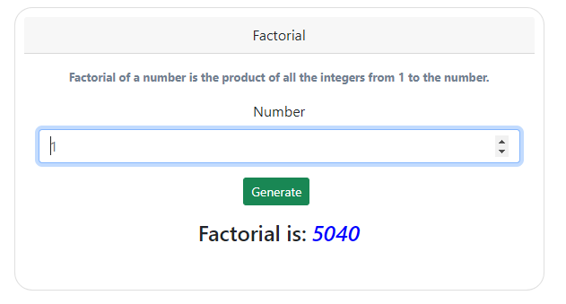

# Project Python Factorial

Computer Version:

[](https://www.microsoft.com/es-es/windows/windows-11?r=1)
[](https://ubuntu.com/)
[](https://www.apple.com/la/mac/)


> <strong> Project to get the factorial of a number done in python. </strong>




[](https://www.python.org/)
[](https://getbootstrap.com/)
[](https://github.com/)
[](https://git-scm.com/)
[](https://www.linux.org/)
[](https://www.microsoft.com/es-es/windows/windows-11?r=1)
[](https://code.visualstudio.com/)


## 💻 Pre requirements
 
 

To use the project on your machine, you must have the following installed:

* They have python greater than 3.8.0
* Have pip installed.
* Have virtualenv or venv installed.

## 🚀 Start virtual environment <python_factorial>

To start the virtual environment of the project <python_factorial>, you must do the following:
* Create a virtual environment at the root of the project.
* Start the virtual environment.

> Linux - macOS:
```
source env/bin/activate
```

> Windows:
```
env\Script\activate
```
## ☕ Requirements <python_factorial>

Install the necessary dependencies of the project. (Make sure you are inside the virtual environment) <python_factorial>:

```
pip install -r requirements.txt
```

## 📫 Start project <python_factorial>


To start the project <python_factorial>, you must follow the following steps:


> Linux - macOS:

1. python3 app.py
2. python3 app.py

> Windows:

1. python app.py
2. python app.py

## Start the service: 
> [http://127.0.0.1:5000/](http://127.0.0.1:5000/)


<div align="center">

### My social accounts


[](https://instagram.com/harlericho8/)
[](https://twitter.com/harlericho)
[](https://github.com/harlericho)
[](https://hub.docker.com/u/harlericho)

</div>

<p align="center"><strong>Copyright © 2022 Harlericho</strong></p>
